<div align="center">
  
</div>

<div align="center">
  
</div>

<div align="center">
  
</div>

## 🎯 Neural Network Architecture - My Skills

<div align="center">
  
</div>

### 🔥 Core Technologies

<div align="center">
  <table>
    <tr>
      <td align="center" width="96">
        
        <br>Python
      </td>
      <td align="center" width="96">
        
        <br>TensorFlow
      </td>
      <td align="center" width="96">
        
        <br>PyTorch
      </td>
      <td align="center" width="96">
        
        <br>Scikit-learn
      </td>
      <td align="center" width="96">
        
        <br>Pandas
      </td>
      <td align="center" width="96">
        
        <br>NumPy
      </td>
    </tr>
    <tr>
      <td align="center" width="96">
        
        <br>Docker
      </td>
      <td align="center" width="96">
        
        <br>AWS
      </td>
      <td align="center" width="96">
        
        <br>Git
      </td>
      <td align="center" width="96">
        
        <br>Jupyter
      </td>
      <td align="center" width="96">
        
        <br>MLflow
      </td>
      <td align="center" width="96">
        
        <br>Streamlit
      </td>
    </tr>
  </table>
</div>

## 🧠 AI/ML Expertise Matrix

<div align="center">
  
</div>

```python
class MLEngineer:
    def __init__(self):
        self.name = "Your Name"
        self.role = "AI/ML Engineer & Data Scientist"
        self.expertise = {
            "Deep Learning": ["CNN", "RNN", "LSTM", "GAN", "Transformer"],
            "Machine Learning": ["Supervised", "Unsupervised", "Reinforcement"],
            "NLP": ["BERT", "GPT", "Sentiment Analysis", "Named Entity Recognition"],
            "Computer Vision": ["Object Detection", "Image Classification", "Segmentation"],
            "MLOps": ["Docker", "Kubernetes", "CI/CD", "Model Monitoring"],
            "Data Engineering": ["Apache Spark", "Kafka", "Airflow", "ETL Pipelines"]
        }
        self.current_projects = [
            "🔥 Real-time Fraud Detection System",
            "🚀 Automated ML Pipeline with Kubeflow",
            "🎯 Computer Vision for Medical Imaging",
            "📊 Time Series Forecasting with Prophet"
        ]
    
    def get_daily_workflow(self):
        return {
            "morning": "📈 Market Analysis & Data Collection",
            "afternoon": "🧠 Model Training & Experimentation", 
            "evening": "📊 Results Analysis & Visualization",
            "night": "📚 Research Papers & Learning"
        }
```

## 🚀 Performance Dashboard

<div align="center">
  
  
</div>

<div align="center">
  
</div>

## 🏆 ML Model Leaderboard

<div align="center">
  
</div>

| 🏅 Model | 📊 Dataset | 🎯 Task | 📈 Accuracy | 🔥 Status |
|----------|------------|---------|-------------|-----------|
| ResNet-50 | CIFAR-100 | Image Classification | 94.2% | 🟢 Production |
| BERT-Base | IMDb Reviews | Sentiment Analysis | 92.8% | 🟢 Production |
| LSTM | Stock Market | Time Series | 87.5% | 🟡 Testing |
| YOLOv8 | Custom Dataset | Object Detection | 89.3% | 🟢 Production |
| XGBoost | Customer Data | Churn Prediction | 91.7% | 🟢 Production |

## 🔥 Featured AI/ML Projects

<div align="center">
  
</div>

### 🤖 [Neural Style Transfer Web App](https://github.com/yourusername/neural-style-transfer)
<div align="center">
  
  
  
</div>

- 🎨 **Real-time artistic style transfer using deep neural networks**
- 🚀 **Deployed on AWS with auto-scaling capabilities**
- 📊 **Processes 1000+ images daily with 95% user satisfaction**
- 🔥 **Featured in top 10 AI projects on GitHub**

### 🧠 [Multimodal AI Assistant](https://github.com/yourusername/multimodal-ai)
<div align="center">
  
  
  
</div>

- 🎯 **Combines vision, text, and audio processing**
- 🔥 **Achieved 94% accuracy on multimodal benchmarks**
- 📈 **Handles 10K+ requests per minute**
- 🏆 **Winner of AI Hackathon 2024**

### 📊 [Real-time Anomaly Detection](https://github.com/yourusername/anomaly-detection)
<div align="center">
  
  
  
</div>

- ⚡ **Real-time processing of 1M+ events per second**
- 🎯 **99.7% precision in fraud detection**
- 🔄 **Automatic model retraining pipeline**
- 💰 **Saved $2M+ in prevented fraud losses**

## 📊 Advanced Analytics Dashboard

<div align="center">
  
</div>

<div align="center">
  
</div>

## 🎯 ML Pipeline Architecture

```mermaid
graph TD
    A[📊 Data Collection] --> B[🔧 Data Preprocessing]
    B --> C[🧪 Feature Engineering]
    C --> D[🤖 Model Training]
    D --> E[📈 Model Evaluation]
    E --> F[🚀 Model Deployment]
    F --> G[📊 Monitoring & Logging]
    G --> H[🔄 Model Retraining]
    H --> D
    
    subgraph "🔥 MLOps Pipeline"
        I[Docker] --> J[Kubernetes]
        J --> K[CI/CD]
        K --> L[Model Registry]
    end
    
    F --> I
```

<div align="center">
  
</div>



## 🌟 Learning Journey & Certifications

<div align="center">
  
</div>

- 🏆 **AWS Certified Machine Learning - Specialty** (2024)
- 🏆 **Google Cloud Professional Data Engineer** (2024)
- 🏆 **TensorFlow Developer Certificate** (2023)
- 🏆 **Kaggle Competitions Expert** (Top 5% in 3 competitions)
- 📚 **Deep Learning Specialization** - deeplearning.ai
- 📚 **MLOps Specialization** - Coursera
- 📚 **CS231n: Convolutional Neural Networks** - Stanford

## 🔥 Real-time Contributions

<div align="center">
  
</div>

<!--START_SECTION:waka-->
```text
Python       12 hrs 30 mins  ███████████████████░░░░░░   76.2%
Jupyter      2 hrs 45 mins   ████░░░░░░░░░░░░░░░░░░░░░   16.8%
Docker       45 mins         █░░░░░░░░░░░░░░░░░░░░░░░░   4.6%
YAML         20 mins         ░░░░░░░░░░░░░░░░░░░░░░░░░   2.1%
Shell        3 mins          ░░░░░░░░░░░░░░░░░░░░░░░░░   0.3%
```
<!--END_SECTION:waka-->

## 🤝 Connect & Collaborate

<div align="center">
  
</div>

<div align="center">
  <a href="https://linkedin.com/in/yourprofile">
    
  </a>
  <a href="https://kaggle.com/yourprofile">
    
  </a>
  <a href="https://medium.com/@yourhandle">
    
  </a>
  <a href="https://twitter.com/yourhandle">
    
  </a>
  <a href="https://huggingface.co/yourprofile">
    
  </a>
</div>

## 📚 Latest Research & Blog Posts

<div align="center">
  
</div>

<!-- BLOG-POST-LIST:START -->
- 🔥 [Optimizing BERT for Production: A Complete Guide](https://medium.com/@yourhandle/optimizing-bert-production)
- 🚀 [Building Real-time ML Pipelines with Apache Kafka](https://medium.com/@yourhandle/realtime-ml-kafka)
- 🧠 [Deep Dive into Attention Mechanisms](https://medium.com/@yourhandle/attention-mechanisms-deep-dive)
- 📊 [MLOps Best Practices: From Notebook to Production](https://medium.com/@yourhandle/mlops-best-practices)
<!-- BLOG-POST-LIST:END -->

## 💡 Innovation Labs

<div align="center">
  
</div>

**🔬 Currently Researching:**
- 🧬 **Graph Neural Networks for Drug Discovery**
- 🎨 **Generative AI for Creative Content**
- 🔊 **Audio Processing with Transformers**
- 🎯 **Federated Learning for Privacy-Preserving ML**

**🎯 2025 Goals:**
- 📈 **Contribute to 10+ Open Source AI Projects**
- 🏆 **Publish 3 Research Papers**
- 🚀 **Launch AI SaaS Product**
- 🌟 **Mentor 50+ Aspiring Data Scientists**

<div align="center">
  
</div>

---

<div align="center">
  
  
  **"Transforming Data into Intelligence, One Algorithm at a Time"** 🚀
</div>

<div align="center">
  
</div>
